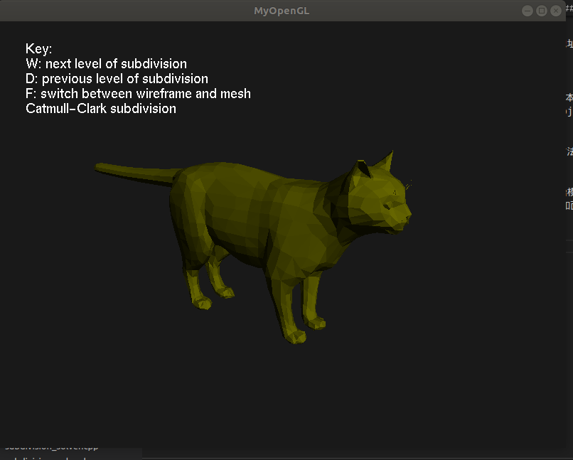
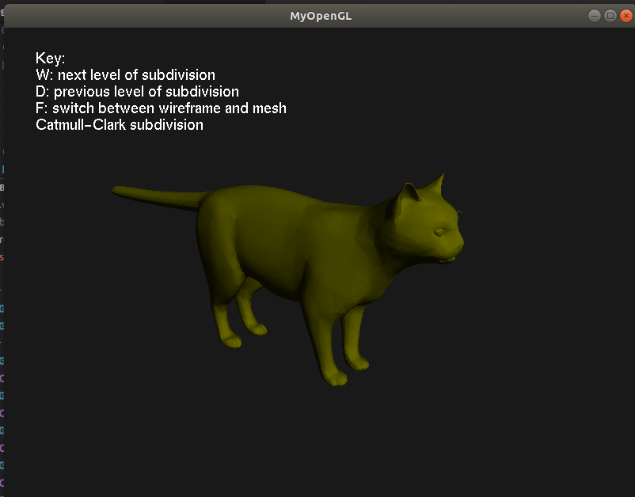
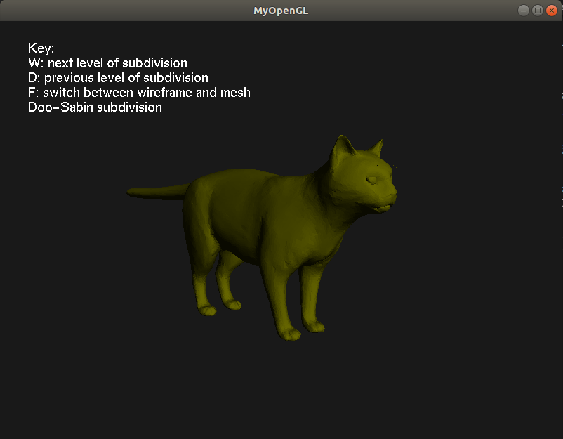

# Doo-Sabin & Catmull-Clark & Loop Subdivision

## 1.程序依赖
* Eigen 3.3.90
* OpenGL
* GLUT
* GLEW
* glfw3

## 2.程序设计
### 2.1数据结构
&nbsp;&nbsp;&nbsp;&nbsp;&nbsp;&nbsp;本文使用以下数据结构，通过维护一个顶点表，边和多边形中顶点信息都指向顶点表。
```cpp
struct Vertex{
        int id; //顶点id
        Eigen::Vector3d p;
        std::vector<index_t> associated_edges;  //顶点相邻的多边形id
        std::vector<index_t> associated_polygons;  //顶点相邻的边id
    };
    
    struct Edge {
        index_t id1;  //顶点1在顶点表的 id
	    index_t id2; //顶点2在顶点表的 id
        std::vector<index_t> associated_polygons;//边相邻的多边形id
    };

    struct Polygon {
        std::vector<index_t>  points; //多边形内顶点的id
        std::vector<index_t>  edges; ///多边形内边的id
        Eigen::Vector3d norm;  //法线
       
    };
```
### 2.2 算法设计
* `SubDivisionSolver`所有细分算法类的父类
  * `GetEdgePoints()`计算每条边的边点
  * `GetFacePoints()`计算每条面的面点
  * `MakeUpMesh()`建立新的mesh类
  * `Run()`抽象函数，由派生类实现，用于运行细分算法

* `LoopSolver`用于实现Loop细分曲面。        
  * `CheckCheirality()`检查输入mesh是否都是三角形。
  * `UpdateEdgePoints()`利用Loop规则更新边点
  * `UpdateVertices()`利用Loop规则更新顶点
  * `Divide()`将更新后的点按照Loop规则连接形成新的mesh
  * `Run()`对输入mesh进行Loop细分

* `CatmullClarkSolver`用于实现CatmullClark细分曲面。        
  * `UpdateFacePoints()`利用Catmullclark规则更新面点
  * `UpdateEdgePoints()`利用Catmullclark规则更新边点
  * `UpdateVertices()`利用Catmullclark规则更新顶点
  * `Divide()`将更新后的点按照Catmullclark规则连接形成新的mesh
  * `Run()`对输入mesh进行CatmullClark细分

* `DooSabinSolver`用于实现DooSabin细分曲面。      
  * `UpdateVertices()`利用DooSabin规则更新顶点，并记录由多边形产生的面
  * `UpdatedEdgePolygon()`从多边形的每一条边出发，顺序记录由边周围顶点产生的面
  * `UpdateVertexPolygon()`从每一个顶点相邻多边形出发，顺序遍历周围多边形，记录由顶点周围点产生的面
  * `Divide()`将更新后的点按照DooSabin规则连接形成新的mesh
  * `Run()`对输入mesh进行DooSabin细分
### 2.3 可视化设计
&nbsp;&nbsp;&nbsp;&nbsp;&nbsp;&nbsp;可视化部分使用OpenGL管道shader管道渲染，场景是一个简单环境光组成的场景，用户交互使用turn tale的交互模型。
### 2.4 引用部分
&nbsp;&nbsp;&nbsp;&nbsp;&nbsp;&nbsp;引用高通OpenGL渲染封装类`gl_shader.h/.cpp`, `gl_geometry.h/.cpp`,以及文字渲染管线`Viewer::PutText()`
### 3.使用说明
&nbsp;&nbsp;&nbsp;&nbsp;&nbsp;&nbsp;运行程序存放在`build/src/mainSubdivisionSurface`，运行程序需要用户输入obj模型地址，顶点着色器地址，片段着色器地址。`Please enter mainSubdivisionSurface [obj_path] [vertex_shader_path] [fragment_shader_path]`。

&nbsp;&nbsp;&nbsp;&nbsp;&nbsp;&nbsp;`run.sh`是用来自动启动程序的脚本,用户运行`run.sh [obj_path]`即可启动，取消脚本中`array=(`ls ${res_dir}/*.obj`)`中语句的注释，即可逐个可视化res/内的内容。

&nbsp;&nbsp;&nbsp;&nbsp;&nbsp;&nbsp;启动程序后，用户需要选择细分的方法:输入`Z`启动Loop细分，`X`启动CatmullClark细分, `C`启动DooSabin细分。

&nbsp;&nbsp;&nbsp;&nbsp;&nbsp;&nbsp;选择细分方法后，用户可以看到初始模型渲染结构（0层），使用`W`进入下一层细分结果，`S`进入上一层细分结果，`F`在线框图和面片着色模式下切换，`esc`结束程序。

### 4.使用说明
运行结果存放在results文件夹中，其中`gm_subdivision.mp4`是程序运行的demo视频。以下是程序运行的截图。

原始模型：
<center class="half">
    
</center>
loop细分结果：
<center class="half">
    
</center>
catmull细分结果：
<center class="half">
    
</center>
doosabin细分结果：
<center class="half">
    
</center>
